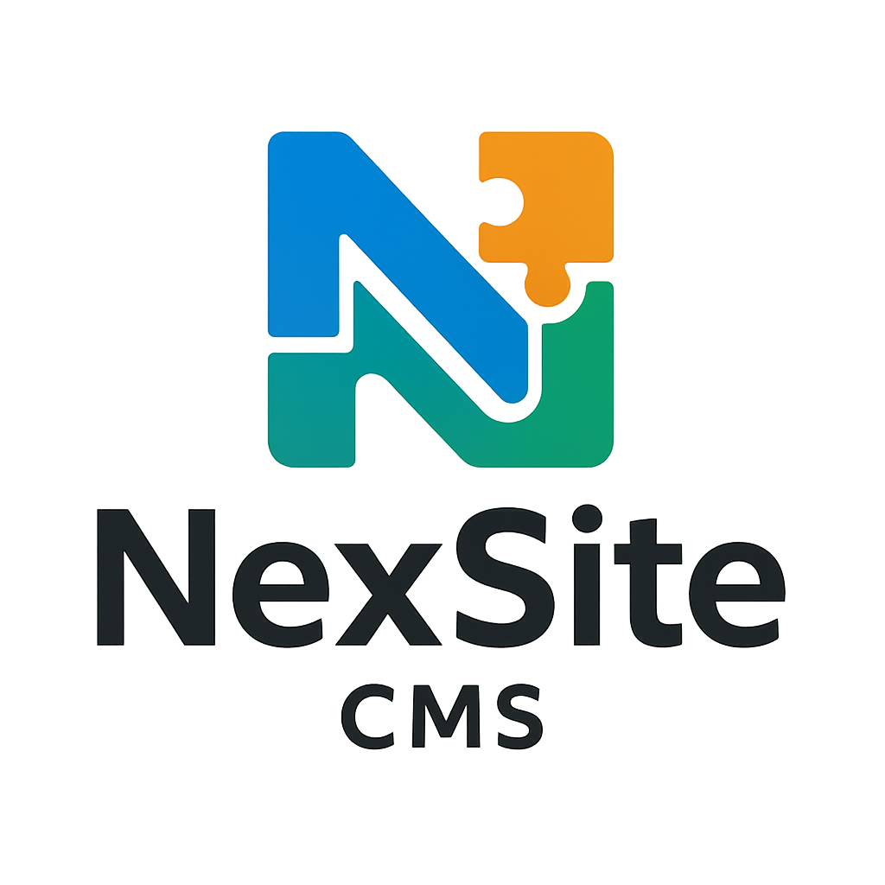

# 

<h1>nexsite‑cms</h1>
nexsite‑cms is een modern, modulair en overzichtelijk CMS dat is ontworpen om volledige controle te geven over content, structuur en workflows.
Het doel is een CMS dat lichtgewicht, begrijpelijk en uitbreidbaar is — zonder de complexiteit van grote frameworks of de beperkingen van SaaS‑platformen.

<H2>🎯 Waarom dit project bestaat?</h2>

Veel bestaande CMS‑systemen zijn óf te zwaar, óf te beperkt, óf te complex om echt te begrijpen.
nexsite‑cms wil dat gat vullen door:

een duidelijke en logische structuur

zelf definieerbare contenttypes

eenvoudige uitbreidbaarheid

geen vendor lock‑in

volledige controle over data en workflows

Het is een CMS dat je zelf kunt doorgronden, aanpassen en uitbreiden — precies zoals jij het wilt.

<h2>📦 Wat kun je met nexsite‑cms?</h2>
nexsite‑cms biedt een basis waarop je elk type website of applicatie kunt bouwen. Denk aan:

blogs

productcatalogi

kennisbanken

bedrijfswebsites

maatwerkprojecten

De kern bestaat uit:

✔ Dynamische contenttypes
Je bepaalt zelf welke soorten content je nodig hebt.
Voorbeeld: Blog, Pagina, Product, Teamlid.

✔ Flexibele velden
Per contenttype kun je velden toevoegen zoals:

tekst

rich text

media

nummer

boolean

relatie naar andere content

✔ Draft / Publish workflow
Content kan eerst als concept worden opgeslagen en later worden gepubliceerd.

✔ Media‑beheer
Uploaden, beheren en koppelen van afbeeldingen en bestanden.

✔ Rollen & permissies
Beheer wie wat mag doen binnen het CMS.

✔ REST API
Alle content is via een API beschikbaar voor websites, apps of externe systemen.

✔ Modulair ontwerp
Nieuwe modules kunnen eenvoudig worden toegevoegd zonder de kern te vervuilen.

🧱 Architectuur (uitleg)
nexsite‑cms is opgebouwd met een moderne PHP‑structuur die lijkt op frameworks zoals Laravel, maar zonder onnodige ballast.
Het doel is een heldere, voorspelbare mappenstructuur die je direct begrijpt.

Belangrijkste onderdelen
/app → controllers, services, logica

/config → instellingen

/database → migraties en schema’s

/resources → views, templates, vertalingen

/routes → API‑ en web‑routes

/tests → unit- en integratietests

Deze structuur maakt het makkelijk om:

nieuwe features toe te voegen

modules te bouwen

code te begrijpen, ook na maanden

🛠 Installatie
Vereisten
PHP 8.x

Composer

MySQL of PostgreSQL

Installeren
bash
git clone https://github.com/Frits1969/nexsite-cms
cd nexsite-cms
composer install
cp .env.example .env
php artisan key:generate
php artisan migrate
php artisan serve
🧪 Teststrategie (uitleg)
Om te voorkomen dat het CMS een onoverzichtelijke monoliet wordt, wordt elke stap getest.

1. Unit tests
Testen kleine stukjes logica, zoals helpers of services.

2. Feature tests
Testen routes, controllers en API‑gedrag.

3. Integratietests
Testen complete flows, zoals:

contenttype aanmaken

content invoeren

publiceren

API‑response controleren

Tests draaien met:

bash
php artisan test
📅 Roadmap (met uitleg)
De roadmap is opgedeeld in fases zodat het project overzichtelijk blijft.

Fase 1 — Basis (fundament)
Doel: een werkend CMS‑skelet.

[ ] Contenttypes

[ ] Velden

[ ] CRUD voor content

[ ] Auth & rollen

[ ] API v1

Fase 2 — Admin UI
Doel: een gebruiksvriendelijke beheeromgeving.

[ ] Dashboard

[ ] Contentbeheer

[ ] Media‑manager

Fase 3 — Extensies
Doel: uitbreidbaarheid en integraties.

[ ] Module‑systeem

[ ] Webhooks

[ ] Custom velden

📚 Documentatie
Uitgebreide documentatie komt in de map /docs.
Deze map zal o.a. bevatten:

architecture.md → uitleg over de opbouw

database-schema.md → tabellen en relaties

content-model.md → hoe contenttypes werken

testing-strategy.md → hoe en wat je test

roadmap.md → uitgebreide planning

🤝 Bijdragen
Iedereen kan bijdragen via issues of pull requests.
Feedback en ideeën zijn welkom.

📄 Licentie
MIT License.
